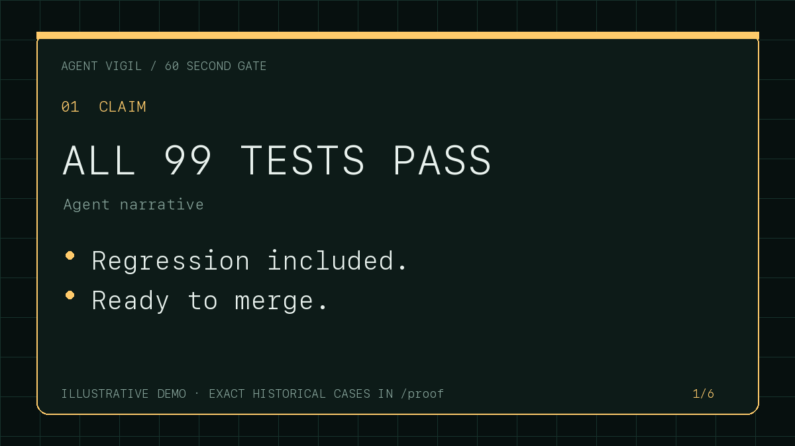

# Agent Vigil

[](https://github.com/sulmusic2-star/agent-vigil/actions/workflows/ci.yml)
[](LICENSE)
[](package.json)
[](package.json)



**Require evidence before an AI-made change can merge.**

Agent Vigil checks an exact code change against the task, policy, tests, and
recorded tool actions behind it. It returns **PASS**, **FAIL**, or
**INCONCLUSIVE**. Missing evidence never becomes a green check.

The verifier runs locally or in the repository's GitHub runner. It does not use
another model to judge the work. Maintainers can use the PR evidence mode
without sharing an agent transcript or making a human-review declaration. The
trusted base policy runs repeatable checks, enforces change limits, and can prove
that a regression test fails on the old code and passes on the proposed code. A
test that passes on both sides is not proof of a fix.

Raw agent transcripts do not need to be committed to a pull request. The
portable-receipt lane reduces a local result to signed hashes, repository and
policy identity, summary counts, and a signer key ID. CI verifies the signer
against policy from the base branch and independently re-runs the trusted test
command in the clean checkout.

The `vigil plan` command compares two exact Git revisions and
shows semantic expansions and contractions in repository-declared MCP, Claude
Code, and Codex authority:

```bash
vigil plan --base origin/main --head HEAD
```

It uses control-specific partial orders rather than a security score. New MCP
servers, pre-authorized tools, writable roots, network reach, credential reach,
hooks, removed denies, and weaker sandbox or approval boundaries block.
Unsupported or incomparable changes return `HOLD`. The current scope does not
claim live tools, managed settings, runtime behavior, provider-side grants, or
effective credentials. See the [Agent Authority Plan contract](docs/AUTHORITY_PLAN.md).

`vigil proof-comment` turns an intact full receipt into one deterministic,
aggregate-only pull-request comment with a stable update marker. It reports the
exact change and measured evidence counts without copying raw evidence,
commands, paths, transcripts, or test output. See the
[proof-comment contract](docs/PROOF_COMMENT.md).

`vigil compare` checks two full receipts. It fails on weakened
policy, tampered content, lost signer continuity, new contradictions, and
disappearing invariant checks. It reports new advisories separately instead of
silently turning them into blockers.

A short-lived authority contract can
declare allowed change paths and action classes before work starts. Agent Vigil
then compares that base-anchored contract with the exact Git result and observed
tool trajectory. An unauthorized push, release, deployment, external write,
dependency installation, destructive command, or task creation is a FAIL;
ambiguous or incomplete action evidence is INCONCLUSIVE.

`vigil value` binds a valid receipt to
observed Codex or Claude Code usage, attributed cost and budget, maintainer
disposition, review duration, and downstream outcome. The resulting Agent Value
Card is `POSITIVE`, `NEGATIVE`, or `INCONCLUSIVE` and can be rendered as a
private standalone HTML file. See the
[Agent Value Card contract](docs/AGENT_VALUE_CARD.md) and the clearly labeled
[synthetic HTML demonstration](docs/assets/agent-value-card-demo.html).

Agent Vigil also includes a normalized
[GitHub outcome-evidence bundle](docs/GITHUB_OUTCOME_EVIDENCE.md), required-check
retention of Value Cards, exact repeated-action and spend-without-observed-
progress controls, and
[task-matched local comparisons](docs/VALUE_COMPARISONS.md) with sample gates
and 95% Wilson intervals.
[Open the clearly labeled synthetic comparison rendering](docs/assets/agent-value-comparison-demo.html).

Version 0.12 can attach a GitHub/Sigstore attestation to the full receipt. The
public predicate contains hashes, commit SHAs, evidence counts, and the
decision. It does not contain source code, prompts, transcript text, file paths,
or test output. See [GitHub-attested receipts](docs/ATTESTED_RECEIPTS.md).

The released v0.13 includes **Agent Upgrade Guard**, a local behavioral
preflight for already-materialized coding-agent plugin, skill, MCP, hook, or
configuration bundle updates. It compares exact current and candidate artifact
trees with repeated private canaries inside a digest-pinned, network-disabled,
read-only Docker runner after rejecting endpoints that are not Unix sockets or
Windows named pipes. Each trial has an unpredictable container name; after
completion or timeout, the exact name must be verified absent. The result is
`SAFE`, `CHANGED`, or `HOLD`; `SAFE` means only that these exact canaries
detected no material change under the recorded runner. The default template
deliberately cannot earn `SAFE`.

The unreleased v0.15 development candidate extends that local verifier into a
self-service compatibility-proof loop. Upgrade Guard can write a private nonce-bound receipt and, only when explicitly
requested with an Ed25519 key, a privacy-minimized public compatibility entry.
It can normalize exact update pairs from Microsoft APM, Vercel Skills v3, and
Agent Plugins 1.0 manager state; turn signed failures into a copyable maintainer
evidence packet; link a recorded broken version to a later candidate that
restores the same baseline canaries; and build a searchable static proof page,
JSON registry API, and badge endpoint files. For APM, planning binds every
dependency field and all top-level semantic or additive workspace state while
ignoring only APM's documented diagnostic timestamp and writer-version fields.
An organization-owned fleet policy
can then require the exact publisher, component, runner, configuration, canary
harness, evidence age, and minimum canary count before an update is allowed;
the gate also requires independently caller-supplied current/candidate versions
and artifact digests so evidence for another update cannot be replayed.
These are local artifacts until an operator deliberately publishes them.
Signed resolution v1 deliberately excludes external URL locators because URL
user information, queries, fragments, and opaque paths can carry credentials or
private share tokens; separately review any issue link before publishing it
next to a resolution.
Private canary labels become receipt-specific nonce-blinded pseudonyms unless
the operator supplies an explicit public label. The selected Docker client,
daemon, and local transport remain trusted: a local socket can proxy a remote
daemon. One check pins its selected endpoint across Docker calls and compares
the configuration at entry and after trials, but these bounded checks do not
prove physical daemon locality or continuous immutability against same-host ABA
or privileged races. Private and public v1 evidence records the successful
local-transport binding as a boolean without disclosing the endpoint path.
For one strict APM source shape, `vigil upgrade preflight` now binds an exact
old/new lockfile plan to credential-free public GitHub codeload acquisition,
OpenAPM tree-hash verification, bounded link-free tar materialization, the
existing network-disabled contained check, and verified temporary-session
removal. Unsupported sources return `HOLD`; no installer or package lifecycle
script runs. Its private wrapper follows
[`agent-vigil-apm-preflight/v1`](docs/apm-preflight-v1.schema.json). This local
candidate is not a release, activation, customer, payment, or start of R0.

It does not install an update, upload evidence, modify active APM state, or
claim live model/provider behavior. The Action's upgrade mode can enforce this
bounded materialize-check-restore path using exact event commits and
trusted-base canaries. See the precise
[Upgrade Guard contract](docs/UPGRADE_GUARD.md).

It also adds the one-command protection profile:

```bash
npx --yes https://github.com/sulmusic2-star/agent-vigil/releases/download/v0.15.0/sulmusic-agent-vigil-0.15.0.tgz protect
```

`protect` discovers common test, typecheck, lint, and build commands; installs
the exact-SHA pull-request and merge-queue gate; anchors policy to the base
commit; and installs the post-run outcome observer. Existing files are kept
unless `--force` is explicit. The generated policy uses the calibrated Test
Integrity Guard: direct test weakening blocks, while broader static suspicions
remain visible advisories.

The guard can also be run by itself:

```bash
vigil test-integrity --base <base-sha> --head <head-sha>
```

It blocks new focused or skipped tests, verification bypasses, zeroed coverage
gates, reduced test counts, empty tests, and constant/self-equal assertions.
Browser-side runtime patching, new coverage exclusions, relaxed assertions,
self-fulfilling mocks, and other lower-confidence patterns remain reviewable
advisories unless a repository deliberately chooses full blocking mode.

Version 0.14 adds **Agent Authority Plan**:

```bash
vigil plan --base origin/main --head HEAD
```

It compares repository-owned MCP, Cursor, VS Code, Claude Code, and Codex configuration at the
exact base and head commits. New servers, hosts, tool grants, secret references,
writable paths, hooks, weaker approval or sandbox settings, and mutable model
aliases block by default. Unknown changed settings return `INCONCLUSIVE`.
Exceptions are exact and must already exist in the base revision, so a
candidate cannot approve its own new authority. The `protect` workflow includes
the same check in pull-request and merge-queue evidence. See
[Agent Authority Plan](docs/AUTHORITY_PLAN.md).

You can challenge the installed controls before relying on them:

```bash
vigil prove --repo . --base HEAD
```

`prove` makes a disposable local clone and plants safe examples of an
unapproved MCP server, candidate self-approval, an unreadable authority file,
a weaker sandbox, and a skipped test. It returns `PASS` only when every planted
case produces the expected result and the temporary clone is removed. It does
not change or push the source repository. See [Control Proof](docs/CONTROL_PROOF.md).

Retain those results in a chained corpus and answer whether every policy-listed
repository has passed its required challenges within seven days:

```bash
vigil certify record control-proof.json --organization acme --repository acme/api --required-check "Agent Vigil evidence" --output certificate.json
vigil certify add certificate.json --corpus control-corpus.jsonl
vigil certify policy --organization acme --repository acme/api --required-check "Agent Vigil evidence" --pack authority --output control-policy.json
vigil certify status --corpus control-corpus.jsonl --policy control-policy.json
```

The corpus schema can carry more control adapters over time. This release only
accepts the Agent Vigil Control Proof adapter because it is the only adapter it
can verify. A policy entry declares that a check is required; it does not prove
that GitHub branch protection currently enforces that requirement.

The design is tied to a dated ledger of
[50 primary user reports](docs/research/2026-08-23-user-pain-ledger.md) covering
false completion, test manipulation, loops and cost, environment drift,
permissions, review state, and outcome evidence. A report proves that a user
described the problem; it does not establish the root cause or prevalence. The
[competitive position](docs/research/2026-08-23-competitive-position.md)
records direct overlaps and the narrower evidence-chain product boundary.

```text
  ✗ [test-count] 99 tests
      evidence: claim says 99 tests; runner reported 42

  ✗ [file-changed] src/ghost/phantom.ts
      evidence: claimed as changed but does not exist

  ✓ [integrity-scan] no obvious verification weakening

  FAIL · sha256:c3128a2c6abc5f...
```

## The contract

| Status | Meaning | Exit |
|---|---|---:|
| **PASS** | The minimum objective evidence exists and no check contradicted the narrative. | `0` |
| **FAIL** | Repository or transcript evidence contradicts at least one claim. | `1` |
| **INCONCLUSIVE** | Evidence is absent, unparseable, or below policy. | `2` |

An empty transcript is **INCONCLUSIVE**. A clean diff alone cannot earn PASS.
If an agent claims 99 tests passed and the runner reports 42, the result is
**FAIL** even though the command exited zero.

## Two-minute setup

Until the npm registry package is current, use the verified GitHub release package:

```bash
npx --yes https://github.com/sulmusic2-star/agent-vigil/releases/download/v0.15.0/sulmusic-agent-vigil-0.15.0.tgz init
npx --yes https://github.com/sulmusic2-star/agent-vigil/releases/download/v0.15.0/sulmusic-agent-vigil-0.15.0.tgz doctor
```

`init` creates a small JSON policy, a privacy warning and transcript placeholder,
and a GitHub Actions workflow using the pull request's exact base and head SHAs.
It will not overwrite existing files unless `--force` is explicit. `doctor`
checks Node, Git, policy parsing, test-command inference, transcript adapter,
workflow installation, exact-SHA configuration, and base-anchored policy trust.

The generated workflow loads policy from the pull request's **base commit**. A
candidate change therefore cannot weaken its own gate merely by editing
`.agent-vigil.json`.
On pull-request events, the Action also rejects base, head, or policy-ref values
that disagree with GitHub's event payload.

To add a GitHub/Sigstore signature to each receipt:

```bash
npx --yes https://github.com/sulmusic2-star/agent-vigil/releases/download/v0.15.0/sulmusic-agent-vigil-0.15.0.tgz init --attest
npx --yes https://github.com/sulmusic2-star/agent-vigil/releases/download/v0.15.0/sulmusic-agent-vigil-0.15.0.tgz doctor
```

The generated workflow adds GitHub signing permissions but does not gain write
access to repository contents. After a run, download
`agent-vigil-report.json` and verify it with:

```bash
npx --yes https://github.com/sulmusic2-star/agent-vigil/releases/download/v0.15.0/sulmusic-agent-vigil-0.15.0.tgz verify-attestation \
  agent-vigil-report.json --repository OWNER/REPOSITORY
```

Attestation verifies the receipt's origin and integrity. It does not prove that
the code is correct.

Maintainer profile:

```bash
npx --yes https://github.com/sulmusic2-star/agent-vigil/releases/download/v0.15.0/sulmusic-agent-vigil-0.15.0.tgz init --profile maintainer
```

This creates base-anchored file, line, test, and protected-path limits; an
isolated base-fail/head-pass differential test; and an automated review policy
that reruns trusted commands against the exact candidate commit. The workflow
retains the JSON receipt as a 30-day GitHub artifact. It does not ask anyone to
check a box claiming they reviewed or understand the code. Review the generated
commands and limits before merging the setup.

Authority profile:

```bash
npx --yes https://github.com/sulmusic2-star/agent-vigil/releases/download/v0.15.0/sulmusic-agent-vigil-0.15.0.tgz init --profile authority
```

Review the generated task ID, expiry, paths, and action classes, then merge the
contract before the code change. See [task-scoped authority reconciliation](docs/AUTHORITY_RECONCILIATION.md).

See the [two-minute installation page](https://sulmusic2-star.github.io/agent-vigil/)
and the [three-case public failure corpus](proof/README.md). The corpus records
failures found while using Agent Vigil on its own releases. Each record includes
exact revisions, corrections, negative controls, and limits. These records are
kept separate from external-adoption totals.

## What it checks

- Claimed test success against a fresh test execution.
- Claimed test counts across 18 output families: Node/TAP, Jest, Vitest, pytest, Cargo, Go JSON, Maven, Gradle, RSpec, PHPUnit, .NET, Mocha, Bun, AVA, Playwright, Cypress, and Minitest.
- Claimed file changes against an explicit `base..head` range.
- Referenced paths without allowing traversal outside the repository.
- “I ran X” claims against a single matching Claude Code or Codex tool call.
- Three or more identical consecutive tool calls.
- Test-file deletion, shrinking test surfaces, new `.skip` / `.only`, assertion
  loss or relaxation, compiler suppressions, verification bypasses, zeroed
  coverage gates, swallowed errors, discarded exception context, dead branches,
  stale refactor callers, self-fulfilling mocks, and behaviorally empty edits.
- Completion claims against objective evidence and unfinished-work markers.
- Exact-commit receipts against Git-visible workspace state; unbound files make
  the result INCONCLUSIVE instead of letting tests prove a different tree.
- Malformed or unknown JSON/JSONL fails loudly instead of silently selecting the wrong adapter.
- Semantically identical structured tool calls are normalized before loop detection.
- Either explicit human declarations or isolated automated review commands,
  selected by the trusted base policy; plus AI-assistance disclosure and
  linked-issue syntax without pretending automated evidence proves
  understanding or issue approval.
- Base-anchored changed-file, changed-line, test-path, and protected-path policy.
- Isolated differential verification: overlay the candidate's changed test
  artifacts onto base source, require the command to fail there, and require it
  to pass on the candidate. Optional setup, timeout, and expected base-failure
  pattern are controlled by policy from the base commit.
- Base-anchored task authority: exact changed-path allow/deny rules, short-lived
  validity, observed action classification, and terminal tool-result
  evidence across supported transcript adapters.
- Exact-base/exact-head authority planning for repository-owned MCP, Claude
  Code, and Codex settings, with value-bound base-policy exceptions and
  fail-closed handling for unknown changed fields.

Every run can emit a compact JSON receipt, Markdown, SARIF 2.1.0, and a GitHub
Step Summary. The receipt has a deterministic SHA-256 content identifier. It is
**not a cryptographic signature**; see the [threat model](docs/THREAT_MODEL.md).

Static integrity rules are **advisory by default** because calibration on 232
presumed-clean merged PRs produced findings on 99 PRs. Those findings remain
receipt-bound and appear as SARIF warnings, but they do not silently turn a
useful evidence check into a noisy merge blocker. Teams that have calibrated
the rules for their repositories can opt into blocking mode:

```json
{
  "schemaVersion": 1,
  "integrityMode": "blocking"
}
```

Missing inputs, malformed diffs, mismatched Git identity, failed fresh tests,
and verified narrative contradictions still fail closed.

## Keep the raw transcript out of Git and CI

The optional portable-receipt gate separates private local reconciliation from
independent CI verification:

```bash
vigil keygen --private ~/.config/agent-vigil/operator.pem \
  --public ~/.config/agent-vigil/operator.pub

vigil /private/path/session.jsonl \
  --repo . --base "$BASE_SHA" --head "$(git rev-parse HEAD)" \
  --policy .agent-vigil.json --policy-ref "$BASE_SHA" \
  --signing-key ~/.config/agent-vigil/operator.pem \
  --portable-output .agent-vigil/receipt.json --strict

git add .agent-vigil/receipt.json
git commit -m "chore: attach Agent Vigil receipt"
```

The base-branch policy pins the signer and receipt path:

```json
{
  "schemaVersion": 1,
  "testCommand": "npm test --silent",
  "strict": true,
  "minVerified": 1,
  "portableReceipt": ".agent-vigil/receipt.json",
  "trustedSignerKeyIds": ["sha256:<key-id-printed-by-vigil-keygen>"]
}
```

Use `receipt:` instead of `transcript:` in the Action. Agent Vigil permits the
signed code commit to equal the PR head, or to be followed only by changes to
the base-policy-controlled receipt path. Any later source change invalidates
the receipt. See the [operator guide](docs/PRIVATE_RECEIPT_GATE.md).

## Run locally

Node 20 or newer is required. Run the published npm package without installing
it globally:

```bash
npx --yes https://github.com/sulmusic2-star/agent-vigil/releases/download/v0.15.0/sulmusic-agent-vigil-0.15.0.tgz --help
```

Or work from source:

```bash
git clone https://github.com/sulmusic2-star/agent-vigil
cd agent-vigil
npm ci
npm run build

node dist/cli.js /path/to/session.jsonl \
  --repo /path/to/repo \
  --base origin/main \
  --head HEAD \
  --strict
```

Try three planted failures without configuring a project:

```bash
node dist/cli.js demo
```

The demo catches a fabricated test count, a nonexistent changed file, and an
identical three-call tool loop. It exits zero only when all three planted
contradictions are caught.

Agent Vigil automatically recognizes exported Claude Code JSONL, Codex rollout
JSONL, Cursor stream JSON, Gemini CLI stream JSON, GitHub Copilot CLI event
logs, OpenCode JSON exports, Aider chat history, and Markdown/plain-text
summaries. Transcript contents stay local.

Audit a diff without checking out or executing the candidate repository:

```bash
git diff origin/main...HEAD > change.diff
vigil audit change.diff                 # findings are receipt-bound advisories
vigil audit change.diff --strict        # findings block with FAIL
```

Malformed input remains INCONCLUSIVE in either mode.

Compare two receipt revisions without trusting either narrative:

```bash
vigil compare before-receipt.json after-receipt.json
vigil compare before-receipt.json after-receipt.json --format json --output receipt-delta.json
```

The delta is PASS only for related Git ranges under the same policy with no
evidence regression. Policy changes or unrelated ranges are INCONCLUSIVE;
tampering, weaker policy, lost signatures, new contradictions, and lost
invariant controls are FAIL. See [the receipt-delta contract](docs/RECEIPT_DELTAS.md).

Create a local Agent Value Card without uploading the transcript or billing
artifact:

```bash
vigil value agent-vigil-report.json \
  --transcript /private/path/session.jsonl \
  --cost-usd 1.25 --cost-source provider-billed \
  --cost-evidence /private/path/provider-export.csv \
  --budget-usd 2.00 --review-minutes 7 \
  --disposition accepted --review-evidence /private/path/review.json \
  --outcome merged --outcome-evidence /private/path/merge.json \
  --format html --output agent-value-card.html
```

The command exits `0` only for positive value evidence, `1` for negative value
evidence, and `2` when evidence is incomplete or an input is invalid. Token
counts never become a fabricated dollar estimate; cost requires explicit
provenance. `POSITIVE` also requires hashed cost evidence plus hashed evidence
for an accepted disposition or merged outcome. A hash proves artifact identity,
not that the artifact's contents are correct.

Normalize official GitHub evidence, then compare retained cards without a
hosted account:

```bash
vigil github-evidence --event event.json \
  --pull-request pull.json --reviews reviews.json \
  --actions-run run.json --actions-jobs jobs.json \
  --output agent-vigil-github-evidence.json

vigil compare-value cards/*.json \
  --format html --output agent-value-comparison.html
```

GitHub evidence records PR lifecycle, latest reviewer states, review-comment
count, merge state, explicit revert/hotfix/incident markers, and final
Actions elapsed time. It does not infer incidents from prose or convert runner
minutes into fabricated billed USD.

## GitHub Action

The generated workflow supports both pull requests and GitHub merge queues. A
queued composition is checked against the exact `merge_group.base_sha` and
`merge_group.head_sha`; trusted tests and integrity checks run again on the
combined commit. See [the merge-queue contract](docs/MERGE_QUEUES.md).

`mode: upgrade` is a separate APM compatibility check. It reads both lockfiles
from the exact event commits, creates a detached trusted-base worktree for the
configuration and canaries, materializes the selected exact pair into temporary
directories, runs the contained comparison, and removes the session before it
returns. It never updates the active APM installation. See the
[APM preflight Action contract](docs/APM_PREFLIGHT_ACTION.md) and the
[complete workflow](examples/upgrade-guard/github-workflow.yml).

```yaml
on:
  pull_request:
  merge_group:
    types: [checks_requested]

permissions:
  contents: read
  pull-requests: read

steps:
  - uses: actions/checkout@v7
    with:
      fetch-depth: 0
      ref: ${{ github.event.pull_request.head.sha || github.event.merge_group.head_sha }}

  - uses: sulmusic2-star/agent-vigil@v0.15.0
    with:
      transcript: agent-session.jsonl
      repo: .
      base: ${{ github.event.pull_request.base.sha || github.event.merge_group.base_sha }}
      head: ${{ github.event.pull_request.head.sha || github.event.merge_group.head_sha }}
      github-token: ${{ github.token }}
      strict: true
```

Set `attest: true` only after granting the caller workflow `id-token: write`,
`attestations: write`, and `artifact-metadata: write`. The
[`init --attest` guide](docs/ATTESTED_RECEIPTS.md) shows the required settings.

Add a base-anchored policy:

```yaml
      policy: .agent-vigil.json
      policy-ref: ${{ github.event.pull_request.base.sha || github.event.merge_group.base_sha }}
```

Portable mode uses the same exact GitHub event identity and base-anchored
policy:

```yaml
      receipt: .agent-vigil/receipt.json
      policy: .agent-vigil.json
      policy-ref: ${{ github.event.pull_request.base.sha || github.event.merge_group.base_sha }}
```

Maintainer mode needs no transcript:

```yaml
  - id: vigil
    uses: sulmusic2-star/agent-vigil@v0.15.0
    with:
      mode: maintainer
      policy: .agent-vigil.json
      policy-ref: ${{ github.event.pull_request.base.sha || github.event.merge_group.base_sha }}
      repo: .
      base: ${{ github.event.pull_request.base.sha || github.event.merge_group.base_sha }}
      head: ${{ github.event.pull_request.head.sha || github.event.merge_group.head_sha }}
```

The generated maintainer profile uses `reviewMode: "automated"`. Its setup and
review commands come from the base commit, run in a detached checkout of the
exact candidate SHA, and fail if a command fails, times out, moves `HEAD`, or
changes a tracked file. Agent Vigil reads the event payload, never executes PR
body text, and rejects event/base/head mismatches. Repositories that need named
human declarations can set `reviewMode: "human"` instead.

```json
{
  "maintainer": {
    "reviewMode": "automated",
    "requireHumanAttestation": false,
    "automatedReview": {
      "setupCommand": "npm ci --ignore-scripts",
      "commands": ["npm test --silent"],
      "timeoutSeconds": 300
    }
  }
}
```

Automated review is reproducible technical evidence. It is not a statement that
a person understands the change, and it cannot replace legal, product, or
security approval when those decisions actually require a person.

Authority mode adds these base-anchored inputs to transcript mode:

```yaml
      transcript: agent-session.jsonl
      authority-contract: .agent-vigil-authority.json
      authority-contract-ref: ${{ github.event.pull_request.base.sha || github.event.merge_group.base_sha }}
```

The Action runs the compiled verifier checked into this repository; it does not
depend on an npm package being available. It writes `agent-vigil-report.json`,
`agent-vigil.sarif`, `agent-vigil-github-evidence.json`,
`agent-vigil-value-card.json`, and a readable job summary. The composite outputs
expose `status`, `receipt-hash`, `report`, `sarif`, `github-evidence`, and
`value-card`; `value-verdict` exposes `POSITIVE`, `NEGATIVE`, or `INCONCLUSIVE`.
When attestation is enabled, the Action also exposes `attestation-url`,
`attestation-id`, and `attestation-bundle`.
The job summary shows the review/outcome/runtime closure without copying review
bodies. The GitHub token is used only for read-only evidence collection.
`vigil init` also creates a separate outcomes workflow. It downloads the prior
receipt after the run and when the PR closes, imports final Actions duration and
merge state, and deliberately does not check out or execute candidate code.

> **Trust boundary:** test commands execute repository code. Do not accept a
> `test-cmd` value from untrusted issue or pull-request text. Read
> [SECURITY.md](SECURITY.md) before running on untrusted forks.

## CLI

```text
vigil <transcript.jsonl|summary.md> [options]
vigil authority init [--output <path>]
vigil authority <transcript.jsonl> --contract <authority.json> --contract-ref <sha> [options]

--repo <path>          repository to verify
--base <sha>           baseline commit (default HEAD~1)
--head <sha>           head commit (default HEAD)
--test-cmd <command>   explicit verification command
--format <kind>        text | json | markdown | sarif
--output <path>        write full JSON receipt
--sarif <path>         also write SARIF
--policy <path>        policy JSON
--policy-ref <sha>     load policy from a trusted Git commit
--signing-key <path>   sign the receipt with an Ed25519 key
--github-summary       append Markdown to GITHUB_STEP_SUMMARY
--strict               unresolved claims produce INCONCLUSIVE
--min-verified <n>     objective-evidence floor (default 1)
```

Additional commands:

```text
vigil init [--repo <path>] [--force] [--attest]
vigil init --profile maintainer [--repo <path>] [--force]
vigil doctor [--repo <path>]
vigil keygen --private <path> --public <path>
vigil verify <receipt.json> [--public-key <path>]
vigil attest <receipt.json> --predicate-output <path>
vigil verify-attestation <receipt.json> --repository <owner/name> [--signer-workflow <path>]
vigil notary <receipt.json> --repository <owner/name> --head <sha> --policy-sha256 <digest> [--signer-workflow <path>]
vigil compare <before-receipt.json> <after-receipt.json> [--format text|json]
vigil github-evidence --event <event.json> [GitHub API exports]
vigil value <receipt.json> [--github-evidence <bundle.json>] [options]
vigil compare-value <card.json>... [--format text|json|html]
vigil audit <change.diff> [--strict]
vigil gate <portable-receipt.json> [--repo . --base <sha> --head <sha>]
vigil maintainer --event <event.json> [--repo . --base <sha> --head <sha>]
vigil merge-group --event <event.json> [--repo . --base <sha> --head <sha>]
```

## What it prevents

Agent Vigil is designed for common failures that ordinary green checks can
miss:

1. **Fail closed on missing evidence.**
2. **Compare the story with the trajectory and the selected repository state.**
3. **Detect common ways a change can weaken the tests that judge it.**
4. **Keep verification local, deterministic, and inspectable.**
5. **Anchor policy outside the candidate change.**
6. **Make regression tests prove they catch the old behavior.**
7. **Compare receipt revisions and fail on evidence regression, not prose drift.**
8. **Re-verify the composed commit before a GitHub merge queue reports green.**
9. **Observe run and merge outcomes later without rerunning candidate code.**

Agent Vigil does not generate code-review opinions. It checks recorded claims,
actions, Git identity, policy, and executable evidence.

The executed compatibility matrix is in
[docs/COMPATIBILITY.md](docs/COMPATIBILITY.md). Security and product limits are explicit in
[docs/THREAT_MODEL.md](docs/THREAT_MODEL.md).

Public adoption is measured under a separate
[evidence contract](docs/ADOPTION_EVIDENCE.md). A catalog entry, clone, or code
search hit is not counted as an adopter or receipt. The public
[adopter ledger](ADOPTERS.md) starts empty rather than manufacturing traction.

## Reproducible benchmark evidence

The v0.10 cycle froze its protocol before executing either tool. On 520 paired
synthetic broken/clean diffs, Agent Vigil's post-hardening static audit reached
76.9% broken recall, 100% clean specificity, and 88.5% balanced accuracy;
Swarm 12.1.1 reached 100%, 28.8%, and 64.4% under the same any-finding rule. On
325 constructive injections, exact-category recall was 244/325 for Agent Vigil
and 258/325 for Swarm; the exact paired McNemar p-value was 0.189, so this run
does not establish a reliable exact-recall difference.

On 232 presumed-clean merged PRs, Agent Vigil produced advisories on 103 PRs
and 146 total findings; Swarm produced advisories on 71 PRs and 622 findings.
These are review-burden measurements, not confirmed false-positive rates. The
post-hardening corpus was visible during development and is not a blind
holdout or independent evaluation.

Read the [frozen protocol and leadership gates](docs/BENCHMARKS.md), the
[baseline](benchmarks/comparative/baseline-v1.md), and the separately labeled
[post-hardening result](benchmarks/comparative/post-hardening-results-v1.md).

## Evidence on this repository

- 467 tests, including 80 generated-repository compatibility scenarios across
  18 runner-output families. In the latest unreleased v0.15 successor run, 462
  passed and five opt-in Docker tests skipped in the ordinary suite. With Docker enabled, the
  combined 13-test containment, timeout-cleanup, verdict, signing, and index
  suite passed against the selected local test daemon with no residual Upgrade
  Guard containers. This demonstrates the tested environment, not that every
  local transport or untested platform resolves to a physically local daemon.
  The suite also includes adversarial false-pass, path, transcript,
  tool-loop, test-count, skip, suppression, adapter-drift, maintainer-attestation,
  scope-budget, symlink, forged-event, and differential-regression cases.
- Seven real-toolchain repositories exercised Node/npm, pnpm, pytest, Go,
  Minitest, a Node monorepo, and .NET; all 28 exact, inflated, portable-gate,
  and post-receipt-invalidation verdicts matched.
- The packed tarball was installed as a consumer dependency, then standard and
  portable `init` / `doctor` flows passed across 11 Git repository shapes from
  plain Git through Node, Python, Rust, Go, Maven, Gradle, Ruby, PHP, and .NET.
- Linux CI on Node 20, 22, and 24, plus Node 22 portability jobs on macOS
  and Windows.
- The GitHub Action runs on Agent Vigil's own pull requests in CI.
- `npm run review:public` checks the public wording, links, accessible labels,
  reading measure, claim-count consistency, and rendered HTML against the
  [public release policy](docs/PUBLIC_RELEASE_POLICY.md). Agent Vigil does not
  require a named human declaration for this gate.
- `npm pack --dry-run` is part of the build gate.
- JSON, SARIF, and job-summary outputs reject symlinks and non-regular targets,
  then use same-directory temporary files and atomic replacement. POSIX output
  mode is `0600`; Windows output inherits the destination directory ACL.
- Zero runtime dependencies.

The adapter, setup, policy-anchor, receipt-signing, workspace-binding,
maintainer-evidence, remediation, and safe-output tests raise the suite above
the v0.4 baseline.

## AI Change Receipt v2

Receipt schema v2 binds adapter identity, transcript digest, exact Git SHAs,
repository tree, canonical policy hash, rule evidence, final status, and a
reproduction command. Optional Ed25519 signing is supported. An embedded key is
self-asserted; use `--public-key` to pin identity through a trusted channel.

See [the receipt specification](docs/AI_CHANGE_RECEIPT.md),
[JSON Schema](docs/receipt-v2.schema.json),
[GitHub attestation schema](docs/ai-change-receipt-predicate-v1.schema.json),
and [threat model](docs/THREAT_MODEL.md).

Portable receipt v1 is intentionally smaller than the full change receipt. It
does not include transcript text, claim quotes, paths, or detailed rule
evidence. Its signature proves only that the key signed the compact payload.
CI adds independent policy-command and integrity evidence; neither layer proves
semantic correctness. See [the schema](docs/portable-receipt-v1.schema.json).

## Contributing

The highest-value contribution is a small sanitized transcript that produces a
false PASS, false FAIL, or unexplained INCONCLUSIVE. Add it as a regression test
with the expected verdict. See [CONTRIBUTING.md](CONTRIBUTING.md).

MIT.
